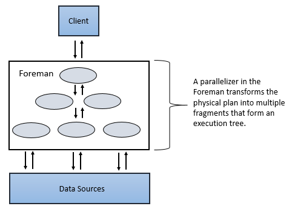

# 查询执行

当你提交一个 Drill 查询，客户端或应用程序会按照查询格式，发送一个 SQL 语句到 Drillbit 服务所在的集群。Drillbit 是一个执行入口，运行计划并执行查询，以及最大化利用分布式查询去完成工作。

下图呈现了客户端，应用程序和 Drillbit 之间的关系：

Drillbit 从客户端或应用程序接受到查询请求后，会将自身角色转变为 Foreman 去带动整个查询。Foreman 利用解析器去解析 SQL，利用自身的规则将其转换成 Drill 能够识别的 SQL，并用于具体的业务逻辑当中。逻辑运算符的集合构成一个逻辑计划。逻辑计划描述生成查询结果所需要的工作，并定义数据源和操作。

Foreman 发送逻辑计划到优化器中进行优化 SQL 语句，并读取逻辑计划。该优化应用各种类型和规则去重新编排运算符和函数，以便让其达到最优。最后将逻辑计划转变为可执行的物理计划。下图为上述的一个流程图：

一个并行处理，在 Foreman 中转换的时候分为多个阶段，由大碎片和小碎片组成。这些碎片会创建一个多层次的执行树，重新配置数据源并重写查询和执行过程，并将最终的结果返回给客户端和应用程序。下图为上述描述的流程图：

## 大碎片

一个大碎片表示的含义为该查询执行阶段的一个概念。该阶段可以由一个或多个操作组成，并且 Drill 必须执行完成一次查询。Drill 给每个大碎片会分配一个碎片 ID，即：MajorFragmentID。

例如，执行一个哈希聚合的两个文件，Drill 可以创建一个执行计划（分为两个阶段），其中一个阶段是扫描这两个文件，另一个阶段是专门去聚合处理数据。如下图所示：

Drill 使用一个交换操作去分离大碎片。交换过程是物理计划上并行的改变数据的位置。一个交换过程是由一个发送器和一个接收器组成的，期间允许数据在节点间移动。

大碎片不执行任何查询任务。每一个大碎片被分成一个或多个小碎片（在下一节中讨论），并完成所需要的查询操作，最终将结果返回给客户端。

抓去一个物理计划中的 JSON 文件，手动去修改它，然后使用提交命令重新提交。你也可以查看大碎片中的查询简介，在 Drill Web Console 中可以看到。

## 小碎片

每个大碎片是并行的小碎片。小碎片是一个逻辑单元，在一个线程中运行。在 Drill 上工作的逻辑单元也被称为切片。执行计划是由 Drill 创建的小碎片组成的，并给每个小碎片标记上碎片ID，即：MinorFragmentID。流程图如下所示：

