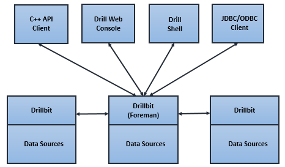
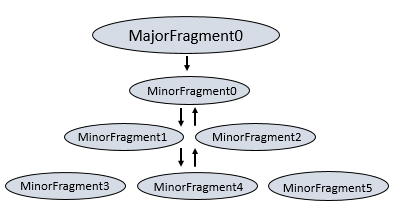

# 查询执行

当你提交一个 Drill 查询，客户端或应用程序会按照查询格式，发送一个 SQL 语句到 Drillbit 服务所在的集群。Drillbit 是一个执行入口，运行计划并执行查询，以及最大化利用分布式查询去完成工作。

下图呈现了客户端，应用程序和 Drillbit 之间的关系：

Drillbit 从客户端或应用程序接受到查询请求后，会将自身角色转变为 Foreman 去带动整个查询。Foreman 利用解析器去解析 SQL，利用自身的规则将其转换成 Drill 能够识别的 SQL，并用于具体的业务逻辑当中。逻辑运算符的集合构成一个逻辑计划。逻辑计划描述生成查询结果所需要的工作，并定义数据源和操作。

Foreman 发送逻辑计划到优化器中进行优化 SQL 语句，并读取逻辑计划。该优化应用各种类型和规则去重新编排运算符和函数，以便让其达到最优。最后将逻辑计划转变为可执行的物理计划。下图为上述的一个流程图：

一个并行处理，在 Foreman 中转换的时候分为多个阶段，由大碎片和小碎片组成。这些碎片会创建一个多层次的执行树，重新配置数据源并重写查询和执行过程，并将最终的结果返回给客户端和应用程序。下图为上述描述的流程图：

## 大碎片

一个大碎片表示的含义为该查询执行阶段的一个概念。该阶段可以由一个或多个操作组成，并且 Drill 必须执行完成一次查询。Drill 给每个大碎片会分配一个碎片 ID，即：MajorFragmentID。

例如，当对两个文件做哈希聚合的操作时，Drill 可以创建一个执行计划（分为两个阶段），其中一个阶段是扫描这两个文件，另一个阶段是专门去聚合处理数据。如下图所示：

Drill 使用一个交换操作去分离大碎片。交换过程是物理计划上并行的改变数据的位置。一个交换过程是由一个发送器和一个接收器组成的，期间允许数据在节点间移动。

大碎片不执行任何查询任务。每一个大碎片被分成一个或多个小碎片（在下一节中讨论），并完成所需要的查询操作，最终将结果返回给客户端。

抓去一个物理计划中的 JSON 文件，手动去修改它，然后使用提交命令重新提交。你也可以查看大碎片中的查询简介，在 Drill Web Console 中可以看到。

## 小碎片

每个大碎片是并行的小碎片。小碎片是一个逻辑单元，在一个线程中运行。在 Drill 上工作的逻辑单元也被称为切片。执行计划是由 Drill 创建的小碎片组成的，并给每个小碎片标记上碎片ID，即：MinorFragmentID。流程图如下所示：

并行化于 Foreman 中，从一次大碎片的执行中，创建一个或多个小碎片。并将一个大碎片碎裂为多个小碎片，而且同时运行在同一集群上。

在其上游数据要求的基础上，Drill 在其自身的线程中尽可能快速地执行每一个小碎片。Drill 在节点上以局部的方式去调度小碎片。否则，Drill 会利用现有的，可用的 Drillbit 以循环的方式去调度。

小碎片包含一个或多个关系运算符，例如：SCAN，FILTER，JOIN 以及 GROUP BY 属于 一个运算符执行关系操作。每个运算符都有一个特定的操作类型和一个 OperatorID。每个 OperatorID 隶属于小碎片。如下图所示：

例如，当对两个文件做哈希聚合的操作时，Drill 针对第一个阶段专门去扫描两个小碎片。每个小碎片都包含扫描操作，用以扫描文件。Drill 针对第二阶段专门聚合成四个小碎片。四个小碎片中的每一个都包含哈希聚合运算符，该运算符在数据上同样要执行哈希聚合操作。

另外，需要注意的是，你不能修改执行计划内的小碎片的数目。然而，你可以在 Drill Web Console 的 Profiles 栏目中查看查询的相关细节，并修改一些配置选项，改变小碎片的行为，例如最大切片数。

## 执行小碎片

小碎片能够以 Root，Intermediate，Leaf 运行。执行树只包含一个 Root 片段。执行树的编号从 Root 开始，下标索引为 0。数据流向从 Leaf 片段流向 Root 片段。

Root 片段运行在 Foreman 上，负责接受查询，从表中读取元数据，重写查询，并将它们路由到下一级服务树上。其他片段将状态切换为 Intermediate 或 Leaf 片段。

Intermediate 碎片在数据可用时开始工作，并将它们提供给其他的片段。它们在数据上执行操作，然后将数据发送给下游。它们也将汇总结果传递给 Root 碎片，该碎片进行进一步聚合，并向客户端或应用程序提供查询结果。

Leaf 碎片在并行的情况下扫描表，并通过访问数据或存储层进行交互于本地磁盘。Leaf 碎片通过部分结果的 Intermediate 碎片，并执行并行操作于 Intermediate 之上。上述流程图如下所示：

Drill 仅计划有并发运行碎片的查询。例如，如果在集群中存在 20 个可用的碎片，Drill 计划在一个特定的大碎片中运行不超过 20 个小碎片的查询。Drill 潜力时可观的，并认为它在并行中能够完成所有的工作。所有的小碎片，在相同时间内，都依赖于它们的上游数据。
