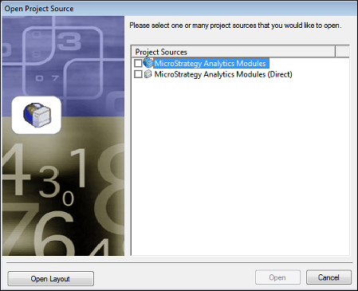
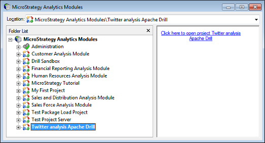

# 社会媒体分析

本教程介绍如何使用 Apache Drill，在原生的 JSON 格式中，分析 Twitter 数据。首先，你使用 Apache 的 Flume 去分割 Twitter 数据中的关键字和语言，然后你使用 Drill 去分析数据。最后，你使用 MicroStrategy 与之进行交互并分析。

## 社会媒体分析条件
  * Twitter 开发者账号
  * AWS 账号
  * 一个 AWS 上的 MapR 节点
  * 一个 MicroStrategy AWS 实例

## 设置 AWS 环境

在 Amazon Web Services（AWS）上配置环境以下任务：
  * 创建一个 Twitter 开发者账号并注册一个 Twitter 应用
  * 提供一个预先设定的 AWS MapR 节点，和 Flume 以及 Drill
  * 提供一个 MicroStrategy AWS 实例
  * 在 MicroStrategy 上配置 Drill，并运行报表和分析
  * 创建一个 Twitter 开发者账号和注册一个应用

该教程是在你熟悉 MicroStrategy 的前提下完成的。更多关于它的使用信息，请看[MicroStrategy 使用指导](http://www.microstrategy.com/Strategy/media/downloads/products/cloud/cloud_aws-user-guide.pdf)

## 建立一个 Twitter 和 Flume 的证书

按以下步骤建立一个 Twitter 并获取 Twitter 证书，需要由 Flume 去建立一个 Twitter 作为数据源：
  1. 去 ``` dev.twitter.com ``` 注册一个你自己的 Twitter 账号。
  2. 点击 ``` Manage Your Apps ``` 在页面底部的工具栏。
  3. 点击 ``` Create New App ``` 并且完善你的表单，然后创建应用。
  4. 在 ``` Keys and Access Tokens ``` 栏中，创建一个 token，然后点击 ``` Create My Access Token ```。你可以创建一个只读权限的 token。
  5. 拷贝以下证书到 Twitter 的 App 中，然后配置 Flume：
    - 消费者的 Key
    - 消费者的秘钥
    - Token
    - Token 秘钥

## 预先在 AWS 上设置一个 MapR 节点

你需要预先在 AWS 上配置一个 MapR 的节点，命名为 ami-4dedc47d。AMI 已经配置了 Flume，Drill，以及特定元素支持的数据流，从 Twitter 和 Drill 的查询视图中。AMI 是一个公开可用社区，它有 6GB 的根目录，以及 100GB 的数据。作为一个小节点，非常大的数据量将大大减少 Twitter 数据查询的响应时间。
  1. 在 AWS 中，启动一个实例。AMI 镜像是预用 m2.2xlarge 实例类型，以及 4 个虚拟 CPU 和 32G 内存。
  2. 选择 AMI 的 id ami-4dedc47d。
  3. 确保你的实例被分配了一个外网 IP，静态 IP 是首选，但不是必需的。
  4. 确保你的节点上的 TCP 和 UDP 端口可用。
  5. 在配置和启动实例后，在 AWS EC2 的管理界面重新启动节点来完成配置。

该节点是需要安装 Flume 和 Drill。下一步，更新 Flume 的配置文件所需要的证书和 keywords。

## 更新 Flume 配置文件

  1. 使用 AWS 证书用 ec2-user 证书登录。
  2. 在节点上使用 ``` su - mapr ``` 切换到 mapr 用户。
  3. 更新 Flume 配置文件 ``` flume-env.sh ``` 和 ``` flume.conf ``` 在 ``` <FLUME HOME>/conf ``` 目录下，在第一节中使用 Twitter App 证书。[实例详情](https://github.com/mapr/mapr-demos/tree/master/drill-twitter-MSTR/flume)。
  4. 输入想要的关键字，用逗号分割。用空格分割多个关键字。
  5. 过滤 Twitter 中特定的语言，如果有必要，输入 ISO 639-1 语言代码去分割并由一个逗号分开。如果你不需要语言过滤，留下一个空白的参数。
  6. 使用 mapr 用户，在屏幕的终端中，输入命令进入到 FLUME HOME 目录。
  7. 输入以下命令启动 Flume：
  ```bash
  ./bin/flume-ng agent --conf ./conf/ -f ./conf/flume.conf -Dflume.root.logger=INFO,console -n TwitterAgent
  ```
  8. 输入 ``` CTRL+a ``` 退出，然后输入 ``` d ``` 进行分离。在回到屏幕的终端，简单的在屏幕上输入 -r 进行重现连接。Twitter 的数据流进入到系统中。
  9. 运行以下命令来验证卷：
  ```bash
  du –h /mapr/drill_demo/twitter/feed.
  ```

你不能运行查询，指导数据出现在目录中。最小允许时间为 20-30 分钟。

## 提供一个 MicroStrategy AWS 实例

MicroStrategy 提供了各种期限的实例。它配备的 MicroStrategy 实例是一个免费试用 30 天的实例。AWS 仍然可以应用于平台和操作系统。

在 AWS 上提供 MicroStrategy 节点：
  1. 在 [MicroStrategy website](http://www.microstrategy.com/us/analytics/analytics-on-aws) 上，点击 “Get started”。
  2. 选择用户，例如，选择 25 用户。
  3. 选择 AWS 区域。推荐在一个 MapR 节点和 MicroStrategy 实例上，使用相同的 AWS 区域。
  4. 点击 “Continue”。
  5. 在标签栏中，点击 “Launch with EC2 Console”，之后再选择 “r3.large instance”。
  6. 点击 “Configure Instance Details” 。
  7. 选择一个合适的网络进行设置，应用到你的 MapR 节点中。
  ```
  重要：确保 MicroStrategy 实例有外网 IP；静态 IP 是首选的，但不是必需的。
  ```
  8. 保留自定义存储。
  9. 分配一个标签来识别实例。
  10. 选择一个安全组，允许足够的权限去访问外网 IP 和开放所有的端口，因为安全这里并不关心。
  11. 在 AWS 控制台，启动实例，当 AWS 报告实例正在运行时，选择它，然后点击 “Connect”。
  12. 点击 “Get Password” 去获取系统的的管理员密码。

实例现在使用 RDP 和使用相关 AWS 的证书和安全。

## 配置 MicroStrategy

你需要配置 MicroStrategy，使用 ODBC 驱动将其集成到 Drill 中。你要先安装一个 MicroStrategy 包和一些有用的数据，为 Twitter 提前准备报告工作。你可以修改报告或使用报表作为模版来创建新的，和更加有趣的报告和分析模型。
  1. 使用 ODBC 管理员，配置系统 DSN 名称为 ``` Twitter ```。MapR ODBC 驱动快速启动一个版本区要 DSN。
  2. [下载基于 Drill 的 MapR ODBC 快速启动版本](http://package.mapr.com/tools/MapR-ODBC/MapR_Drill/MapRDrill_odbc_v0.08.1.0618/MapRDrillODBC32.msi)。
  3. 配置 ODBC 驱动到 MicroStrategy。Drill 是包的一部分，不需要去配置。
  4. 如果 MapR 节点和 MicroStrategy 实例在相同的区域内，使用 AWS 的内网 IP（推荐）。
  5. 下载 [Drill 和 Twitter 的配置](https://github.com/mapr/mapr-demos/blob/master/drill-twitter-MSTR/MSTR/DrillTwitterProjectPackage.mmp) 包，该包是 Windows 系统的，可以使用 Git 命令将其 Clone 下来。

## 导入报表

  1. 在 MicroStrategy 中，选择 “Schema > Create New Project ”，去创建一个新的项目工程。
  2. 点击 “Create Project” 并指明新工程的名称。
  3. 点击 “OK”。项目出现在 MicroStrategy 开发版本中。
  4. 打开 MicroStrategy 对象管理。
  5. 连接到项目源，并使用管理员身份登录。
  
  
  6. 进入到 MicroStrategy 对象管理的分析模块，选择项目。例如，选择 “Twitter analysis Apache Drill”。
  
  7. 选择 “Tools > Import Configuration Package”。
  8. 打开配置文件包，并点击 “Proceed”。
  

  该包的报告在 MicroStrategy 是可用的。

你可以在 MicroStrategy 中测试和修改报告。配置权限是必需的。
