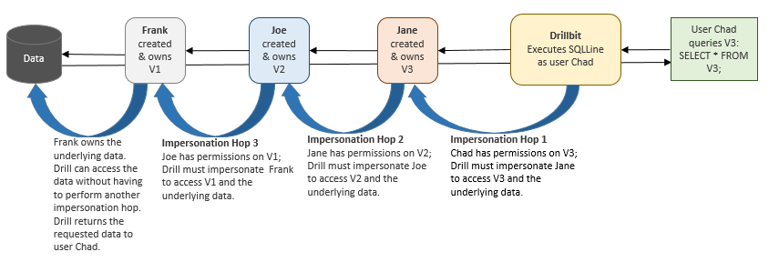
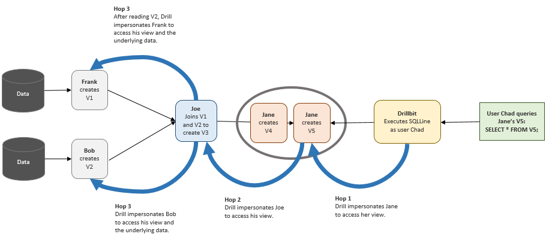
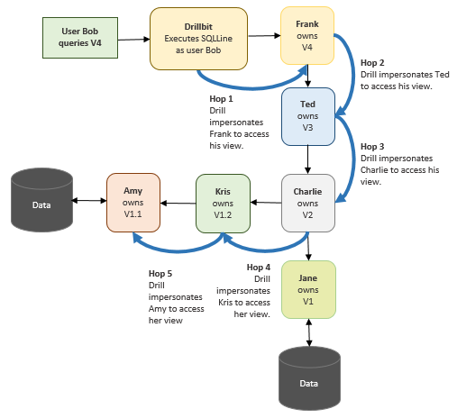

# 配置模拟身份

模拟允许服务的行为，执行客户端所请求的动作。默认情况下，模拟身份在 Drill 上是禁止的。你可以配置模拟身份在 ``` /conf/drill-override.conf ``` 文件下。

当你启用模拟身份，Drill 会执行客户端请求，让用户登录到客户端。Drill 将用户凭证传递给文件系统，然后文件系统会检查该用户是否有权限访问数据。当你启用认证，Drill 用可插拔认证模块（PAM）来验证用户的身份之前，用户可以访问 Drillbit。详情见用户验证。

如果模拟身份没有配置，Drill 执行所有客户端请求，在文件系统为用户服务的节点上启动 Drillbit 服务。这是一个典型的特权用户。该文件系统验证该系统用户具有访问数据的权限。

## 例子

当模拟身份被禁用，然后用户通过 SQLLine 客户端发送一个查询请求，SQLLine 会通过查询去连接 Drillbit。Drillbit 执行查询的系统用户，会在节点上开始处理。例如，我们假设系统用户已经完全访问文件系统。Drill 执行该查询并将结果返回给客户端。


当模拟身份被启用，用户通过 SQLLine 客户端发送一个请求，Drillbit 会先验证该用户访问文件系统中数据的权限。如果有，Drill 将查询结果返回给客户端。如果该用户没有权限，Drill 返回一个错误。


## 模拟身份支持

下表列出了客户端，存储插件，查询类型，可以在 Drill 中使用模拟身份：

| 类型 | 支持 | 不支持 |
| -- | -- | -- |
| 客户端 | SQLLine，ODBC，JDBC | Drill Web 控制台，REST API |
| 存储插件 | 文件系统 | Hive，HBase |
| 查询 | 当你启动模拟身份，设置适用于对数据和元数据的查询。例如，如果你使用 SHOW SCHEMAS 命令，Drill 模拟用户登录到客户端去访问元数据。如果你使用 SELECT 查询工作区间，Drill 模拟用户登录到客户端去访问数据。Drill 模拟用户的查询适用以下命令： SHOW SCHEMAS，SHOW DATABASES，SHOW TABLES，CTAS，SELECT，CREATE VIEW，DROP VIEW，SHOW FILES。为了成功运行 CTAS 和 CREATE VIEW 命令，用户必须在存在的表和视图上拥有写权限。运行这些命令在文件系统中创建部件| 无 |

##模拟身份和视图

你可以使用视图的模拟提供访问数据和保护敏感信息。当你创建一个视图，Drill 会以后缀名为 ``` .drill.view ``` 存储一个视图到文件中。例如，如果你创建一个视图的名字叫 myview，Drill 创建一个视图文件叫 myview.drill.view 并保存它到当前的工作目录或是指定的工作目录，例如 dfs.views.myview。详见 [CREATE VIEW](#) 命令。

你可以创建一个视图并授予读的权限，该读权限是对于其他用户访问时的权限。当一个用户查询视图，Drill 模拟视图所属者访问底层的数据。如果用户尝试访问数据目录，Drill 会返回一个权限不足的错误。访问视图的用户可以从源视图中创建新视图，以进一步限制数据的访问。

## 视图权限

用户必须有写权限在该目录或者拥有在工作区间去创建一个视图，和前面提到的读取表或视图一样。当用户创建一个视图，权限默认设置为它自己。用户可以查询存在的视图或创建一个新视图从现有的视图中，如果他们有读取视图的权限，它们会被存储在在目录或工作区间。

当用户查询一个视图，Drill 访问创建视图的基础数据。如果用户没有访问视图的权限，该查询失败，并返回一个错误。只有视图的所有者或者超级用户可以修改视图的权限。

视图的所属者或超级用户权限，可以直接修改视图文件或设置权限在系统或会话级别创建视图之前。任何修改视图权限的用户都必须在其工作目录或工作区间上拥有写权限。

## 在视图文件上修改权限

只有视图的所属者或超级用户能够修改视图文件去改变它们的从个人到组。之前你授权给用户去访问视图，验证他们有权限去访问目录或工作区间在存储的视图文件中。

使用 ``` chmod ``` 或 ``` chown ``` 命令去改变一个视图文件的权限。
```bash
hadoop fs –chmod <octal code> <file_name>
hadoop fs –chown <user>:<group> <file_name>
```

例如：``` hadoop fs –chmod 750 employees.drill.view ```

## 修改系统/会话级别的视图权限

使用 ``` ALTER SESSION|SYSTEM ``` 命令并结合 ``` new_view_default_permissions ``` 参数，去设置视图权限。
```bash
ALTER SESSION SET `new_view_default_permissions` = '<octal_code>';
ALTER SYSTEM SET `new_view_default_permissions` = '<octal_code>';
```

例如：``` ALTER SESSION SET `new_view_default_permissions` = '777'; ```

在你设置该参数之后，在会话或在系统级设置的所有会话中创建的每一个视图中具有相同的权限。

## 链接模拟

当你在 ``` drill-override.conf ``` 文件中，启用模拟后，你可以在视图中设置允许链接模拟。链接模拟控制身份转变的次数，当用户查询一个视图的时候，每个身份转换等于一次跳转。

管理员可以设置最大跳转限制次数，可以模拟不同用户在其他用户的查询视图的次数。默认最大跳转数为 3。当最大跳转数设置为 0，Drill 不允许模拟链接，用户可以直接读取数据，他们有直接访问权限。管理员可以设置链接长度为 0，以保护高度敏感的数据。

下面的例子描述了这样一个场景，最大跳转数为 3，Drill 必须模拟三个用户访问数据，由 Chad 去查询 Jane 创建的视图：



上面的例子，Joe 创建的视图 V2 是在 Frank 的基础上创建。在下面的例子中，Joe 创建视图 V3 在 Frank 和 Bob 两人的基础上创建。



尽管 V3 的创建是连接了两个不同的视图，然跳转的次数仍然是 3，因为 Drill 不会读取重复的次数。Drill 先读取 V2，然后在读取 V1。

在接下来的例子中，Bob 查询 V4 在 Frank 创建的基础上。Frank 的视图创建来源于底层视图。Charlie 连接 Jane 的 V1 和 Kris 的 V1.2 创建了 V2。Kris 创建 V1.2 来源于 Amy 的 V1.1，增加链接的复杂性。这里设置跳转数为 4，是超过了上限的。



当 Bob 查询 Frank 的视图，Drill 返回一个错误状态导致查询不能完成，因为进入数据查询需要的跳转数超过了最大的跳转数，被设置成了 4。

如果用户遇到此错误，管理员可以增加最大跳设置，以适应用户在视图上运行查询。

## 配置模拟和链接

链接是一个系统范围的设置，使用于所有的视图。当前，Drill 不提供可选项来允许不同视图中的不同链接长度。

完成以下步骤，在每个 Drillbit 节点上启用用户模拟，并设置 Drill 允许的最大链接：
  1. 定位到 ``` <drill_installation_directory>/conf/ ``` 目录，然后编辑 ``` drill-override.conf ``` 文件。
  2. 在 ``` drill.exec ``` 下，增加以下内容：
    ```bash
    drill.exec.impersonation: {
        enabled: true,
         max_chained_user_hops: 3
    }
    ```

    另外，你可以嵌套模拟在 ``` drill.exec ``` 块中，如下所示：
    ```bash
    drill.exec: {
           cluster-id: "cluster_name",
           zk.connect: "<hostname>:<port>,<hostname>:<port>,<hostname>:<port>",
           sys.store.provider.zk.blobroot: "hdfs://",
           impersonation: {
             enabled: true,
             max_chained_user_hops: 3
           }
    }
    ```
  3. 将启用设置为 ``` true ```。
  4. 设置 Drill 允许的最大链接数。
  5. 在每个 Drill 节点，重启 Drillbit。
    ```bash
    <DRILLINSTALL_HOME>/bin/drillbit.sh restart
    ```

## 模拟和链接示例

Frank 是一个公司的高级 HR 人事管理。他有权限访问所有员工数据，因为他是 hr 组的一员。Frank 创建一个表，名叫 “employees”，并在他自己的 home 目录下存储员工数据。仅仅只有 Frank 有权限访问该表。
```bash
drwx------ frank:hr /user/frank/employees
```

在员工表中的每条记录由以下信息组成：

|emp_id| emp_name| emp_ssn| emp_salary| emp_addr| emp_phone| emp_mgr|
| --   | --      | --     | --        | --      | --       | --     |
| -    | -       | -      | -         | -       | -        | -      |

Frank 需要共享一个信息的子集给同样身为 HR 管理员的 Joe。为了共享员工数据，Frank 创建了一个视图 emp_mgr_view 来允许访问子集数据。emp_mgr_view 视图筛选出敏感的员工信息，例如员工的社保卡，然后仅仅展示数据报表直接给 Joe。Frank 和 Joe 两人都属于 mgr 组。管理员有读取 Frank 目录的权限。
```bash
rwxr----- frank:mgr /user/frank/emp_mgr_view.drill.view
```

emp_mgr_view.drill.view 文件包含的视图定义如下：
```bash
视图定义：
SELECT emp_id, emp_name, emp_salary, emp_addr, emp_phone FROM `/user/frank/employee` WHERE emp_mgr = 'Joe'
```

当 Joe 使用 ``` SELECT * FROM emp_mgr_view ```，Drill 模拟 Frank 的身份进入到员工数据，Joe 有权限去看基础视图并拿到查询返回数据。查询结果不包含敏感数据，因为视图被保护了。如果 Joe 尝试直接查询员工表，Drill 返回一个错误或 null 值。

因为 Joe 在 emp_mgr_view 上有读权限，他能够创建一个新视图，让其他用户访问员工数据，他没有自己的员工表，因而他不能直接访问员工表。

Joe 需要他的直接下属分享员工的联系资料，所以他创建了一个特殊的视图被称为 emp_team_view 与他的团队分享员工的联系信息。Joe 创建视图，并将其写入到 home 目录。Joe 和他的报告属于一组名为 joeteam。joeteam 组具有读取权限，读取 Joe 的 home 目录，以便查询视图并创建新视图。
```bash
rwxr----- joe:joeteam /user/joe/emp_team_view.drill.view
```
emp_team_view.drill.view 文件包含的视图定义，如下所示：
```bash
视图定义：
SELECT emp_id, emp_name, emp_phone FROM `/user/frank/emp_mgr_view.drill`
```

当 Joe 小组的任何人使用 ``` SELECT * FROM emp_team_view ```，Drill 模拟 Joe 的身份进入 emp_team_vie，然后，模拟 Frank 去访问 emp_mgr_view 和 员工数据。Joe 小组能够看基础视图定义并拿到 Drill 返回的数据。如果 Joe 小组的任何人尝试去直接查询 emp_mgr_view 或员工表，Drill 返回一个错误或 null 值。

因为 Joe 小组有读取 emp_team_view 的权限，他们能创建一个新视图，在他们的权限范围内，写视图到任何目录。创建视图直到 Drill 达到最大的模拟跳转数为止。
