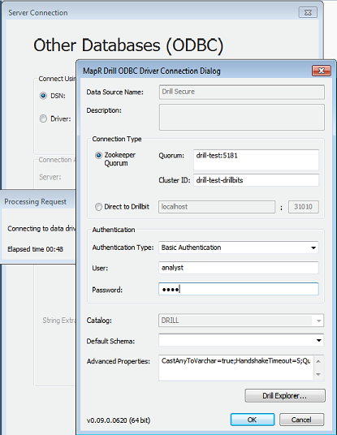
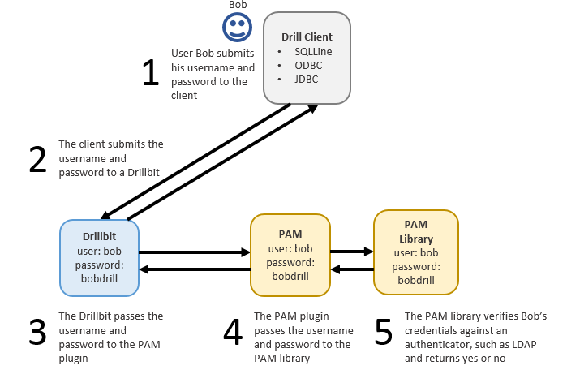

# 配置用户身份验证

认证是一个用户在系统上识别身份，访问一个进程的过程。Drill 目前支持用户名/密码通过 Linux 认证模块来认证（PAM）。身份验证选项可以通过 JDBC 和 ODBC 接口。Linux PAM 提供了认证模块接口，比如本地的操作系统的密码文件或者 LDAP。

如果用你启用模拟，Drill 以认证身份执行客户端请求。否则，Drill 以开始启动的 Drillbit 进程的用户来执行客户端请求。你可以既启用认证又启用模拟来提高 Drill 安全。详情见 [配置模拟身份](4.配置模拟身份.md)

当使用 PAM 来认证，每个有权限运行 Drill 查询的用户，必须存在每个节点的用户清单中。用户名（包含 UID）和密码必须在所有的 Drill 节点上识别通过。

如果使用 PAM 在 /etc/passwd 来认证，在集群中所有的节点上，验证的用户有权限启动 Drill 进程，他们是用户组的一部分。使 Drill 读取 /etc/shadow 文件，进行身份验证。

## 管理员权限

当启用身份认证，仅管理员能够执行以下任务：
  * 使用 ``` ALTER SYSTEM ``` 命令改变系统级别的选项
  * 通过 REST API 或 Web 控制台，更新存储插件配置
  * 在当前的集群上，浏览所有用户的查询记录
  * 在集群上取消任何用户正在运行的查询

## 用户认证进程

当用户认证启用，每个用户可以通过客户端进入 Drillbit 进程，比如 SQLLine，必须提供他们的用户名和密码方能进入。

一个用户包含了 ``` -n``` 和 ``` -p ``` 参数，这表示用户名和密码，当打开 SQLLine 时，使用以下示例命令：
```bash
sqlline –u jdbc:drill:zk=10.10.11.112:5181 –n bob –p bobdrill
```

另外，一个用户登录到 SQLLine， 然后输入 ``` !connect ``` 命令来隐藏密码，执行过程如下所示：
  1. 打开 SQLLine，由 sqline 脚本运行，在 Linux 中，示例如下所示：
    ```bash
    bobsmachine:~$ /etc/drill/bin/sqlline
     apache drill 1.2.0
     "a drill in the hand is better than two in the bush"  
    ```
  2. 出现 sqlline 提示后，输入 ``` !connect ``` 命令，像 ``` jdbc:drill:zk=zk=<zk name>[:<port>][,<zk name2>[:<port>]... ] ``` 这样。如下所示：
    ```bash
    sqlline> !connect jdbc:drill:zk=localhost:2181
    scan complete in 1385ms
    ```
  3. 在出现的提示中，输入用户名和密码。
    ```bash
    Enter username for jdbc:drill:zk=localhost:2181: bob
    Enter password for jdbc:drill:zk=localhost:2181: *************
    ```
    密码作为隐藏类型。

当用户通过 BI 工具取连接 Drill，例如 Tableau，MapR Drill 的 ODBC 驱动提示输入用户名和密码：



客户端通过用户名和密码到 Drillbit 的连接请求，然后通过凭据 PAM。如果 PAM 能够验证通过，连接成功，然后能够发送查询到文件系统，或其他存储插件，例如 Hive 或 HBase。可是，如果 PAM 不能验证通过，连接终端出现 ``` AUTH_FAILED ```。

以下为用户在 Drill 中验证的流程图：



## 安装和配置 PAM

安装和配置 Drill PAM。Drill 这里仅支持 PAM。以下为可选，你可以 [编译和实现通用的认证](#)。
```bash
提示：不要指向一个已存在的 Hadoop 组件安装目录。其他文件系统库可能与 Drill 库冲突，导致系统错误。
```

在 Drill 中通过以下步骤来完成和设置 PAM：
  1. 下载 ``` tar.gz ``` 文件到 Linux 平台：
    [http://sourceforge.net/projects/jpam/files/jpam/jpam-1.1/](http://sourceforge.net/projects/jpam/files/jpam/jpam-1.1/)
  2. 解压文件，然后拷贝 ``` libjpam.so ``` 文件到不包含其他 Hadoop 组件的文件目录中。
    例如：``` /opt/pam/ ``` 目录
  3. 增加以下行到 ``` <DRILL_HOME>/conf/drill-env.sh ```，包含 ``` libjpam.so ``` 文件的地方：
    ``` export DRILLBIT_JAVA_OPTS="-Djava.library.path=<directory>" ```
    例如：``` export DRILLBIT_JAVA_OPTS="-Djava.library.path=/opt/pam/" ```
  4. 在 ``` drill.exec ``` 块中增加以下配置到 ``` <DRILL_HOME>/conf/drill-override.conf ```：
    ```bash
    drill.exec {
         security.user.auth {
           enabled: true,
           packages += "org.apache.drill.exec.rpc.user.security",
           impl: "pam",
           pam_profiles: [ "sudo", "login" ]
         }
    }
    ```
  5. （可选）增加或删除不同的 PAM 配置文件，添加或删除配置文件名称中的 ``` “pam_profiles” ```。
  6. 在每个 Drill 节点上重启 Drillbit 进程。
    ```bash
    <DRILLINSTALL_HOME>/bin/drillbit.sh restart
    ```

## 实现和配置自定义验证

管理员可以使用提供的模板来开发和实现一个自定义的基于用户名/密码的认证。

完成以下步骤来构建和实现一个自定义认证：
  1. 构建以下 Java 文件：
    ```java
     MyCustomDrillUserAuthenticatorImpl.java

     package myorg.dept.drill.security;

     import org.apache.drill.common.config.DrillConfig;
     import org.apache.drill.exec.exception.DrillbitStartupException;

     import java.io.IOException;

     /*
     * Implement {@link org.apache.drill.exec.rpc.user.security.UserAuthenticator} for illustraing how to develop a custom authenticator and use it in Drill
     */
     @UserAuthenticatorTemplate(type = “myCustomAuthenticatorType”)
     public class MyCustomDrillUserAuthenticatorImpl implements UserAuthenticator {

      public static final String TEST_USER_1 = "testUser1";
      public static final String TEST_USER_2 = "testUser2";
      public static final String TEST_USER_1_PASSWORD = "testUser1Password";
      public static final String TEST_USER_2_PASSWORD = "testUser2Password";

     /**
     * Setup for authenticating user credentials.
     */
      @Override
      public void setup(DrillConfig drillConfig) throws DrillbitStartupException {
        // If the authenticator has any setup such as making sure authenticator provider servers are up and running or
        // needed libraries are available, it should be added here.
      }

     /**
     * Authenticate the given <i>user</i> and <i>password</i> combination.
     *
     * @param userName
     * @param password
     * @throws UserAuthenticationException if authentication fails for given user and password.
     */
      @Override
      public void authenticate(String userName, String password) throws UserAuthenticationException {

        if (!(TEST_USER_1.equals(user) && TEST_USER_1_PASSWORD.equals(password)) &&
        !(TEST_USER_2.equals(user) && TEST_USER_2_PASSWORD.equals(password))) {
          throw new UserAuthenticationException(“custom failure message if the admin wants to show it to user”);
        }
      }

     /**
     * Close the authenticator. Used to release resources. Ex. LDAP authenticator opens connections to LDAP server,
     * such connections resources are released in a safe manner as part of close.
     *
     * @throws IOException
     */
      @Override
      public void close() throws IOException {
        // Any clean up such as releasing files/network resources should be done here
      }
     }
    ```
  2. 添加构建好的 JAR 文件到每个 Drill 节点：
    ```bash
    <DRILLINSTALL_HOME>/jars
    ```
  3. 在 ``` <DRILLINSTALL_HOME>/conf/ ``` 目录中的 ``` drill-override.conf ``` 文件中，添加以下配置到 ``` drill.exec ``` 模块中：
    ```bash
    drill.exec {
      security.user.auth {
          enabled: true,
          packages += "myorg.dept.drill.security",
          impl: "myCustomAuthenticatorType"
      }
    }  
    ```
  4. 在每个 Drill 节点上重启 Drillbit 进程。
    ```bash
    <DRILLINSTALL_HOME>/bin/drillbit.sh restart
    ```
