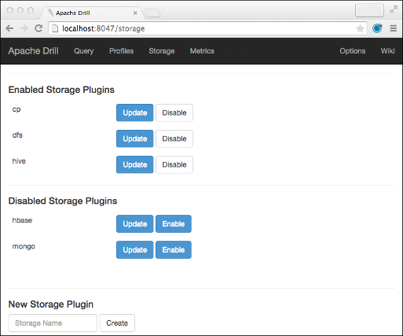

# 插件基础设置

当你在集群中安装了多个 Drill，你在一个 Drill 节点上添加或更新存储插件配置，Drill 会广播信息给其他的 Drill 节点，来同步存储插件配置。当你新增和更新存储插件时，你不需要重启任何的 Drillbit 服务。

## 使用 Drill Web 控制台

你可以使用 Drill Web 控制台来更新和新增一个新的存储插件配置。启动 Web 控制台时，确保 Drill 的服务是正常运行的。

创建一个新的存储插件：
  1. 打开 Drill 服务。
  2. 打开 Web 控制台。
  3. 在 Storage 栏，输入名称到 “New Storage Plugin” 模块下。每个注册的插件名字必须唯一。名字是区分大小写的。

  
  ```bash
  注意：URL 依赖于你的安装和配置。
  ```
  4. 点击“Create”。
  5. 在配置时，使用 JSON 格式去修改复制一个已存在的配置。使用复制已存在的配置，来减少 JSON 编码的出错。使用存储插件属性表，在下节会指导大家去使用。
  6. 点击“Create”。

## 存储插件属性

下图展示了基础存储插件关键的属性：


## 属性和定义列表

下表描述了你可以配置的存储插件的相关属性。

| 属性  | 示例名称 | 是否需要| 描述 |
| --  | -- | -- | -- |
|"type"|"file","hbase","hive","mongo"|是|可用的存储插件类型名称。|
|"enabled"|true,false|是|存储插件状态。|
|"connection"|"classpath:///","file:///","mongodb://localhost:27017/","hdfs://"|实现依赖|分布式文件系统类型，例如 HDFS，Amazon S3，或在你的文件系统中的文件，以及地址/路径。|
|"workspaces"|null,"logs"|否|一个或多个工作区间名称。如果工作区间被一个或多个使用，仅仅最新定义的那个有效。|
|"workspaces"... "location"|"location":"/Users/johndoe/mydata","location":"/tmp"|否|在文件系统中的全路径。|
|"workspaces"... "writable"|true,false|否|一个或多个唯一的工作区间。如果定义了不止一次，最后一次的工作区间名称将覆盖其他。|
|"workspaces"... "defaultInputFormat"|null,"parquet","csv","json"|否|格式化读取的数据，默认是 “parquet”。|
|"formats"|"psv","csv","tsv","parquet","json","avro","maprdb","sequencefile"|是|一个或多个可用的文件格式。Drill 检测某些文件的格式；有些则需要配置。maprdb 格式在 mapr-drill 安装包中。|
|"formats"... "type"|"text","parquet","json","maprdb","avro","sequencefile"|是|格式化类型。你可以定义两种格式，csv 和 psv 当作 “Text” 类型，但有不同的分隔符。|
|"formats"... "extensions"|["csv"]|格式依赖|扩展 Drill 能够读取的文件名称。|
|"formats"... "delimiter"|"\t",","|格式依赖|一系列的字符去分割文本文件，例如 CSV。使用 4 位进制代码语法\uxxxx为非打印分隔符。|
|"formats"... "quote"|"""|否|在一个分隔的文本文件中，用一个单引号开始/结束一个值。|
|"formats"... "escape"|"`"|否|用单引号来标记一个值。|
|"formats"... "comment"|"#"|否|用 “#” 来注释分割的文本文件。|
|"formats"... "skipFirstLine"|true|否|设置 true，避免读取数据中的头。|
|"formats"... extractHeader|true|否|当读取分割数据时，设置 true 来读取头来作为列名。否则，设置 false 将会跳过第一行。|

## 使用格式属性
