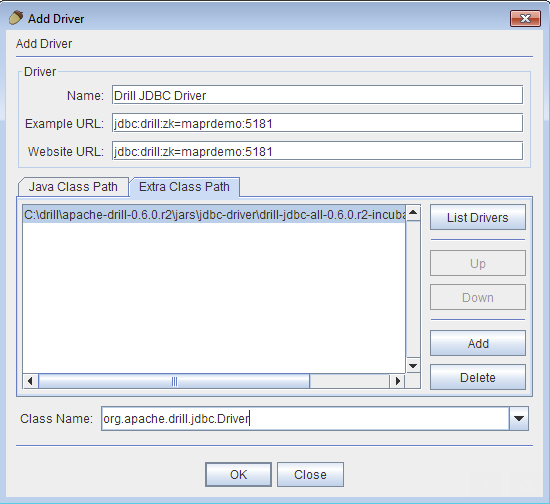
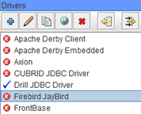
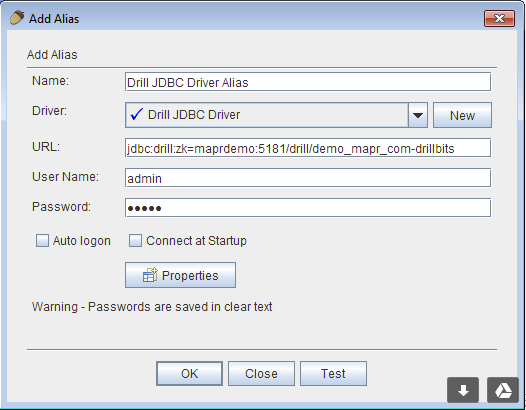
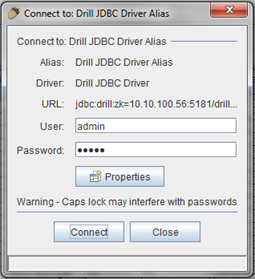
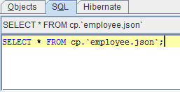

# 在 Windows 上使用 JDBC 和 SQuirreL

为了使用 JDBC 驱动通过 SQuirreL 去访问 Drill，确保你提前准备以下模块。

## 先决条件

  * SQuirreL 需要 JRE 7
  * Drill 安装在分布式模式在集群中的一个或多个节点上。
  * 客户端必须能够解决 Drill 节点实际的主机名和 IP。验证 DNS 条目是在客户机上 Drill 节点创建。

如果 DNS 不存在，创建一个 Drill 节点的入口。
```
* 对于 Windows，创建入口在 %WINDIR%\system32\drivers\etc\hosts file.
* 对于 Linux 和 Mac, 创建入口在 /etc/hosts.  
```

例如：``` 127.0.0.1 maprdemo ```

## 步骤1：获取 Drill 的 JDBC 驱动

Drill 的 JDBC 驱动 JAR 文件必须存在你的 Windows 机器目录中，为了能够配置你的 SQuirreL 客户端。

你可以复制 Drill 的 JDBC JAR 文件从 Drill 的安装目录节点中，Windows 机器上的目录：
```
<drill_installation_directory>/jars/jdbc-driver/drill-jdbc-all-<version>.jar
```

或者，你可以去下载 [apache- drill-1.0.0.tar.gz](http://apache.osuosl.org/drill/drill-1.0.0/apache-drill-1.0.0.tar.gz) 文件到你本地的 Windows 机器上，然后解压文件。你可能需要解压工具，例如 [7-zip](http://www.7-zip.org/)。完成解压后，你可以在以下目录获得驱动：
```
<windows_directory>\apache-drill-<version>\jars\jdbc-driver\drill-jdbc-all-<version>.jar
```

## 步骤2：安装和启动 SQuirreL

为了安装和启动 SQuirreL，完成以下步骤：

  1. 下载 SQuirreL JAR 文件到 Windows 上，下载地址：[http://www.squirrelsql.org/#installation](http://www.squirrelsql.org/#installation)
  2. 双击 SQuirreL JAR 文件。SQuirreL 安装向导会在安装过程中引导你。
  3. 当你安装完成，定位到 SQuirreL 安装文件夹，然后双击 ``` squirrel-sql.bat ``` 去启动 SQuirreL。

## 步骤3：增加 Drill 的 JDBC 驱动到 SQuirreL

为了增加 Drill JDBC 驱动到 SQuirreL，需要定义驱动和创建数据库别名。别名指定初始化驱动信息。SQuirreL 使用驱动定义和别名来连接到 Drill，以至于你能访问数据源。

### A.定义驱动

为了定义 Drill JDBC 驱动，完成以下步骤：

  1. 在 SQuirreL 工具栏，选择 ``` Drivers > New Driver```。增加驱动对话框出现。
  
  2. 输入以下信息：

    | 可选  | 描述 |
    | --  | -- |
    |名称|Drill JDBC 驱动名称|
    |示例 URL|jdbc:drill:zk=[;schema=]Example: jdbc:drill:zk=maprdemo:5181 注意：默认 ZooKeeper 端口是 2181。在 MapR 集群中，ZooKeeper 端口是 5181。|
    |Website URL|jdbc:drill:zk=[;schema=]Example: jdbc:drill:zk=maprdemo:5181 注意：默认 ZooKeeper 端口是 2181。在 MapR 集群中，ZooKeeper 端口是 5181。|
    |类路径|在 Windows 目录中，定位到 JDBC JAR 文件位置：/jars/jdbc-driver/drill-jdbc-all-0.6.0-incubating.jar，选择 JAR 文件，点击打开，然后点击驱动列表。|
    |类名|从下拉框中选择 org.apache.drill.jdbc.Driver|
  3. 点击 OK。SQuirreL 客户端显示驱动注册成功的信息，然后你可以在驱动面板看到驱动。
  

### B.创建别名

为了创建一个别名，完成以下步骤：

  1. 选择别名栏。
  2. 在 SQuirreL 工具栏上，选择 ``` Aliases > New Alias ```。增加别名的对话框出现。
  
  3. 填写以下信息：
  * Alias Name：一个唯一名称的 Drill JDBC 驱动别名
  * Driver：选择 Drill JDBC 驱动
  * URL：填写连接 Drill 的 URL 信息
  * User Name：admin
  * Password：admin
    1. 点击 OK。连接对话框出现。
    
    2. 点击 Connect。SQuirreL 显示连接成功的信息。
    
    3. 点击 OK， SQuirreL 展示一系列的标签。

### 输入连接信息

在步骤3上，创建一个别名，使用以下连接 URL：
```bash
jdbc:drill:zk=<zookeeper_quorum>/<drill_directory_in_zookeeper>/<cluster_ID>;schema=<schema_to_use_as_default>
```
以下示例展示 URL 在单节点上的 Drill：
```bash
jdbc:drill:zk=10.10.100.56:5181/drill/demo_mapr_com-drillbits;schema=hive
jdbc:drill:zk=10.10.100.24:2181/drill/drillbits1;schema=hive
```
以下示例展示 URL 在分布式集群上使用 ZooKeeper 集群来连接：
```bash
jdbc:drill:zk=10.10.100.30:5181,10.10.100.31:5181,10.10.100.32:5181/drill/drillbits1;schema=hive
```
  * 包含一个默认的 schema 是可选的。
  * ZooKeeper 的端口是 2181。在 MapR 集群上，ZooKeeper 的端口是 5181。
  * Drill 目录存储在 ZooKeeper 的 ``` /drill ```上。
  * Drill 默认的集群 ID 是 drillbits1。

## 步骤4：在 SQuirreL 中运行 Drill 查询

使用 SQuirreL 成功连接到集群后，你可以在 SQuirreL 客户端上查询。你可以运行一个测试查询在一些简单的数据上。

为了在 SQuirreL 上查询简单数据，完成以下步骤：
  1. 点击 SQL 栏。
  2. 在框中输入以下查询内容：
  ```bash
  SELECT * FROM cp.`employee.json`;
  ```
  例如：
  
  3. 按下 ``` Ctrl+Enter ``` 去运行查询。查询结果如下所示：
  

到这里，你已经成功在 SQuirreL 客户端上运行 Drill 查询了。
