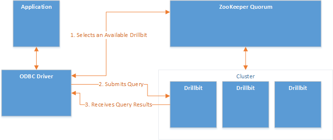
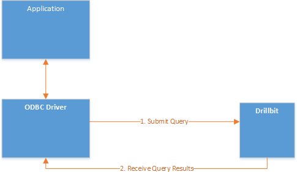

ODBC 配置参考

你可以使用不同的配置选项控制 MapR Drill ODBC 驱动。你也可以使用这些选项在连接字符串或 odbc.ini 配置文件。
```
注意：如果你使用连接字符串去连接你的数据源，将配置属性配置在 odbc.ini 文件中。
```

## 配置选项

以下列表提供了配置选项和简要概述的清单。随后的章节中详细描述的更多选项：

| 属性 | 值 |简述|
|--|--|--|
| Catalog | DRILL |在该目录下，所有的 Schemas/Databases 都是有组织的。|
|ConnectionType|直接连接或者使用 Zookeeper|直接使用主机名和端口号连接到 Drill 服务。Zookeeper 连接到 Zookeeper 集群，使用 ZKQuorum 和 ZKClusterID 属性。|
|Driver|MapR Drill ODBC 驱动|安装驱动的名称。|
|Host|<主机名>|如果连接类型属性设置为直接连接，配置主机名去连接到 Drill 服务。|
|Port|31010|如果连接类型属性设置为直接连接，配置 TCP 端口为 Drill 服务监听的端口。|
|Schema|< schema 名称 >|当查询没有显式指定该模式或存储插件时，默认使用数据库 Schema 或存储插件名称。|
|ZKClusterID|drillbit1|如果连接类型属性设置为 Zookeeper，设置 ZKClusterID 的名称到 Drillbit 集群中。|
|ZKQuorum|< IP 地址 >,< IP 地址 >...|如果连接类型属性设置为 Zookeeper，设置你的 Zookeeper 集群地址，以逗号分割。|
|AuthenticationType|不认证或基本认证|基本认证启用[模拟]()|
|UID|<用户名>|如果认证类型是基本认证，给 UID 设置一个用户名称。|
|PWD|<密码>|如果认证类型是基本认证，给 PWD 设置一个密码。|
|AdvancedProperties|{<property>;<property>; . . .}|使用分号分割属性，然后用{}连接所有的属性。|
|DisableAsync|0 或 1|禁用异步ODBC连接，使同步连接。状态的改变发生在驱动程序初始化和传播到所有驱动的 DSN 。|

### Catalog

该值默认是 DRILL 并且不能改变。该驱动程序添加了一个名为 DRILL 的合成目录，所有的 Schemas 和 Databases 都是有组织的。驱动映射到 ODBC schema 到 DRILL 目录。

### Connection Type

ODBC 能够直接连接到 Drillbit 或者使用 Zookeeper Quorum。选择你连接的类型基于你的环境和 Drillbit 的配置，如下表所示：

| 环境 | 连接类型 |
|--|--|
|Drillbit 运行在嵌入模式|直接连接 Drillbit|
|Drillbit 注册在 ZooKeeper 的测试环境|ZooKeeper Quorum 或直接连接 Drillbit|
|Drillbit 注册在 ZooKeeper 的生产环境|ZooKeeper Quorum|

## 主机名和端口号

当使用 ZooKeeper 去连接 Drill，不要使用 IP 地址在连接字符串中。确保客户端系统能够 ping 通主机名。

## ZKClusterID 和 ZKQuorum

默认的集群 ID 是 drillbits1。检查 ``` drill-override.conf ``` 在 ``` /conf ``` 目录下。使用  cluster-id 和 zk.connect 的值作为 ZKClusterID 和 ZKQuorum。

### 连接到 ZooKeeper Quorum

当你选择去连接 ZooKeeper Quorum，ODBC 驱动连接到 ZooKeeper Quorum 要得到一系列可用的 Drillbits 在指定的集群中。然后，ODBC 驱动提交查询后会选择一个 Drillbit。所有的 Drillbits 在集群中查询，Drillbit 接受查询后的结果。


在生产环境中，你应该连接到  ZooKeeper Quorum 作为一个更加可靠的连接。如果一个 Drillbit 不可用了，其他在  ZooKeeper Quorum 中注册的 Drillbit 能够接受查询。

### 直接连接到 Drillbit

当你选择直接连接到 Drillbit，ODBC 驱动连接到 Drillbit 并提交查询。如果直接连接的 Drillbit 不是集群的一部分，Drillbit 会处理你连接的查询。如果你直接连接的 Drillbit 是集群的一部分，所有的 Drillbits 会处理查询。在任何情况下，Drillbit 的 ODBC 驱动连接会返回查询结果。


### Schema

一个 Schema 的名称或存储插件，来源于你配置使用的数据源的默认列表中。可以通过显示的指定查询中的模式来查询其他 Schema 的查询。

使用 Drill 资源管理器创建的视图不会出现在与数据源类型相关的模式下。相反，在保存视图时，可以从基于文件的 Schema 中访问视图。

驱动支持以下 Schema 类型：
  * HBase
  * 分布式文件系统（DFS），支持以下格式：
    * Parquet
    * JSON
    * CSV
    * TSV
  * Hive

### 高级属性

高级属性允许你自定义 DSN。
使用分号分割高级属性。

例如，以下高级属性字符串不包括名为 ``` test ``` 和 ``` abc ``` 的 Schema；设置超时为 30 秒；并设置时间区域为 Coordinated Universal：
```bash
Time:HandshakeTimeout=30;QueryTimeout=30;
TimestampTZDisplayTimezone=utc;ExcludedSchemas=test,abc
```

下表列出和描述了高级属性，在使用 MapR Drill ODBC 驱动时，你可以对其进行配置。

| 属性名 | 默认值 |描述|
|--|--|--|
|HandshakeTimeout|5|一个整数值表示，在放弃试图连接到数据源的驱动程序等待的秒数。当设置为0的值时，驱动程序不中止连接尝试。|
|QueryTimeout|180|一个整型值，该值表示在自动停止查询之前，该驱动程序的秒数。当设置为0的值时，驱动程序不会自动停止查询。|
|TimestampTZDisplayTimezone|local|两种可能：本地时间戳是依赖于用户的时区。UTC 时间戳出现在 Coordinated Universal Time（UTC）。|
|ExcludedSchemas|sys, INFORMATION_SCHEMA|罗列不出现在客户端应用程序中的 Schema，例如 Drill 资源管理器，Tableau 和Excel。使用逗号分割。|
|CastAnyToVarchar|true|将 SQL 中列返回的任意数据类型，转化为 “VARCHAR”。|
|NumberOfPrefetchBuffers|5|在驱动程序中记录批处理队列的大小。当设置为值低于 1 时，默认值为 1。|

### 连接字符串示例

如果你想连接到 Drill 数据源从应用程序中，而又不需要 DSN，你可以使用 ODBC 连接字符串。以下示例连接字符串是一个直接连接类型：
```bash
DRIVER=MapR Drill ODBC Driver;AdvancedProperties={HandshakeTimeout=0;QueryTimeout=0;TimestampTZDisplayTimezone=utc;ExcludedSchemas=sys,INFORMATION_SCHEMA;};Catalog=DRILL;Schema=hivestg;ConnectionType=Direct;Host=192.168.202.147;Port=31010
```
以下示例连接字符串属于一个 ZooKeeper 连接类型：
```bash
DRIVER=MapR Drill ODBC Driver;AdvancedProperties={HandshakeTimeout=0;QueryTimeout=0;TimestampTZDisplayTimezone=utc;ExcludedSchemas=sys, INFORMATION_SCHEMA;};Catalog=DRILL;Schema=;ConnectionType=ZooKeeper;ZKQuorum=192.168.39.43:5181;ZKClusterID=drillbits1
```

## 日志选项

配置日志记录以解决问题。为了配置日志，点击日志选项按钮在 ODBC DSN 设置对话框，然后设置一个日志等级和一个日志路径。

如果启用了日志记录，MapR Drill ODBC 驱动日志事件记录在以下日志文件路径，你可以配置以下属性：
  * driver.log：一个日志的驱动事件
  * drillclient.log：一个日志的 Drill 客户端事件。

### 日志等级

以下日志等级可用：
  * OFF：禁用日志。
  * FATAL：记录严重错误事件，可能导致驱动程序停止运行。
  * ERROR：记录错误事件，可以允许驱动程序继续运行。
  * WARNING：记录潜在有害情况的事件。
  * INFO：记录进程的高级事件。
  * DEBUG：记录可能有助于调试问题的详细事件。
  * TRACE：比调试级别更细粒度的事件。

### 启用日志

启用日志：
  1. 打开 ``` mapr.drillodbc.ini ``` 配置文件，进行文本编辑。
  2. 设置日志等级。例如：``` LogLevel=2 ```
  3. 设置日志路径，例如：``` LogPath=/localhome/employee/Documents ```
  4. 保存 ``` mapr.drillodbc.ini ``` 配置文件。

### 禁用日志

禁用日志：
  1. 打开 ``` mapr.drillodbc.ini ``` 配置文件，进行文本编辑。
  2. 设置 LogLevel 键为 0
  3. 保存 ``` mapr.drillodbc.ini ``` 配置文件。
