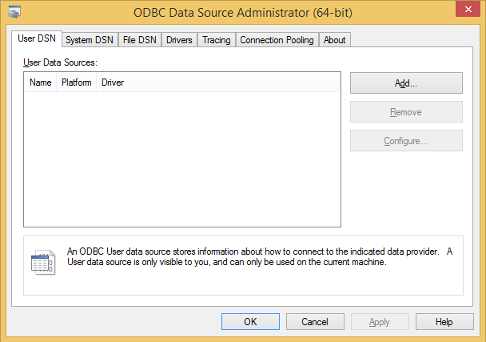
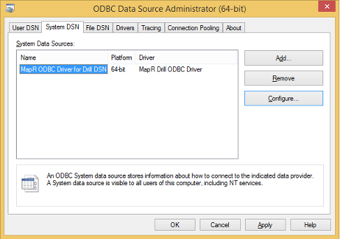
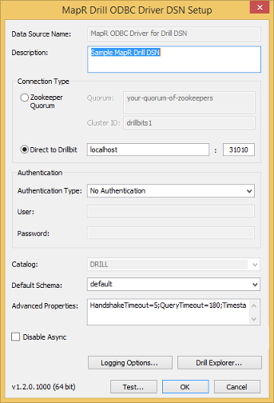
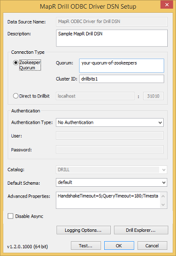

# 在 Windows 上配置 ODBC
完成以下步骤来创建 Windows 环境下的一个 ODBC 连接到 Drill 数据源：
  * 创建一个数据源名称
  * 创建一个 ODBC 连接字符串

# 示例 ODBC 配置（DSN）
你可以通过以下配置步骤，明白如何去创建一个 DSN 连接到 Drill 数据源。如果你想创建一个 32 位得 DSN 应用，你必须使用 32 位版本的 ODBC 去管理创建 DSN。
  1. 点击“Start”，然后定位到你安装的应用，然后再以管理员身份点击 ODBC 启动应用。出现如下图所示的ODBC 数据源对话框。

  
  2. 在 System DSN 模块下，选择示例 MapR ODBC 驱动到 Drill 的 DSN。

  
  在 System DSN 设置所有人可用。你也可以设置成仅仅由创建者拥有使用权限。
  3. 点击 Configure。
  MapR Drill ODBC 驱动 DSN 设置对话框出现在配置示例中。以下截屏显示了 DSN 的相关配置示例。

  

# 认证可选项
通过密码保护 DSN，采用 AuthenticationType，在认证选择的下拉栏中选择基本认证，并配置 UID 和 PWD 属性。若是配置无密码保护，选择无认证项。

# 直接到 Drillbit 和 Zookeeper 集群可选项
在连接模块中，直接连接到 Drillbit 选择使用 Drill 嵌入模式。为了使用 Drill 嵌入模式，直接配置连接类型并定义 HOST 和 POST 属性。例如：
  * ``` HOST=localhost ```
  * ``` PORT=31010 ```
检查 ``` drill-override.conf ``` 文件中的端口是否改变。
若是使用分布式模式，选择使用 Zookeeper 集群。
如果你选择使用 Zookeeper 集群，提供以下值属性：
  * Zookeeper 节点的连接格式，如下所示：
  ```bash
   <host name/ip address> : <port number>, <host name/ip address> : <port number>,...
   ```
  * Drillbit 集群中的集群 ID 名称。检查 drill-override.conf 文件中的 Zookeeper 节点信息是否改变。
检查 ``` drill-override.conf ``` 文件中集群的名称。


